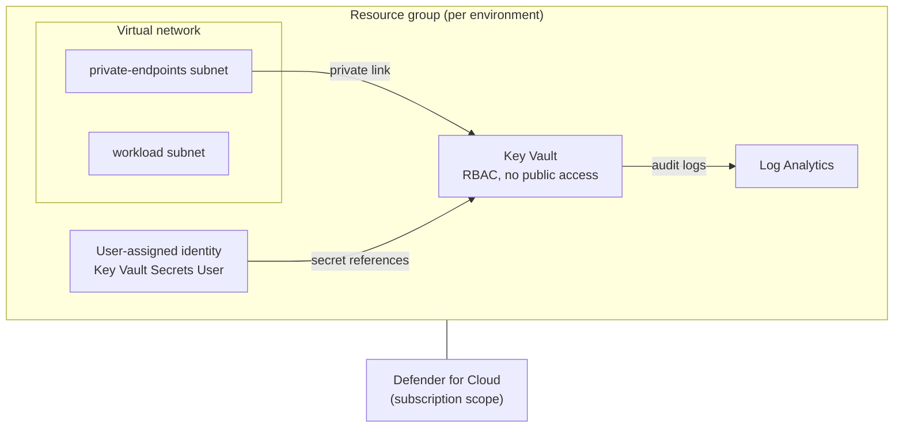

# Secretless Azure


Bicep modules and Azure DevOps pipeline templates for a **secure-by-default Azure baseline
platform**. Everything authenticates with managed identities, the secret store is private by
default, and there is no password, account key or connection string anywhere in this repo.
None gets passed through a pipeline either.

The modules are generic building blocks; the `secure-platform` composition wires them into one
opinionated, locked-down platform per environment.

## What you get

The platform is deployed once per environment (dev/prod) into its own resource group:

- **Key Vault** — RBAC authorization, soft delete, purge protection, network ACL set to `Deny`,
  public access off, reached only through a private endpoint.
- **Virtual network** with a `private-endpoints` and a `workload` subnet, plus the private DNS
  zone for the vault.
- **User-assigned managed identity** with `Key Vault Secrets User`. Workloads attach it to
  resolve secrets without ever holding a credential.
- **Log Analytics** with audit/diagnostic settings streamed from the vault.
- **Microsoft Defender for Cloud** plans on the subscription (optional, on by default in prod).



Heads up: the pipelines are Azure DevOps YAML, not GitHub Actions. The Bicep part has no
dependency on them though, plain `az deployment group create` works fine.

## Repository structure

```text
.
├── bicep/
│   ├── modules/                  # Generic, reusable building blocks
│   │   ├── network/              # vnet, private DNS zone, private endpoint
│   │   └── security/             # role assignment, Defender for Cloud
│   └── compositions/
│       └── secure-platform/      # The locked-down baseline platform (per environment)
│
├── pipelines/
│   ├── deployments/              # Entry points (this repo's own pipelines)
│   ├── stages/                   # Stage templates
│   └── jobs/                     # Job templates
│
└── README.md
```

### Modules

| Module | Creates |
|---|---|
| `key-vault.bicep` | Key Vault with RBAC, soft delete, purge protection, optional private-only + diagnostics |
| `log-analytics.bicep` | Log Analytics workspace |
| `managed-identity.bicep` | User-assigned managed identity |
| `network/virtual-network.bicep` | Virtual network with a configurable list of subnets |
| `network/private-dns-zone.bicep` | Private DNS zone linked to a VNet |
| `network/private-endpoint.bicep` | Private endpoint for any service, with DNS zone group |
| `security/role-assignment.bicep` | Resource-group scoped role assignment (any role) |
| `security/defender-for-cloud.bicep` | Microsoft Defender for Cloud plans (subscription scope) |

### Composition

`secure-platform` has its own [README](bicep/compositions/secure-platform/README.md) with a
parameter table plus `main.dev.parameters.json` / `main.prod.parameters.json`.

| Composition | Use case |
|---|---|
| `secure-platform` | Per-environment secure baseline: vnet + private endpoint, Key Vault, identity, logs, Defender |

## Pipelines

| Template | Flow |
|---|---|
| `stages/infra-pipeline.yml` | security scan, resource group, what-if validate, deploy |
| `stages/infra-whatif.yml` | resource group, what-if validate (no deploy) |
| `jobs/security-scan-job.yml` | gitleaks (secrets) + checkov (IaC misconfiguration), SARIF artifacts |

Every infra deployment runs `az deployment group what-if` in its own stage before anything is
changed, and the security scan runs first.

| Entry point | Purpose |
|---|---|
| `deployments/platform-dev.yml` / `platform-prod.yml` | Deploy the platform (manual trigger) |
| `deployments/teardown-dev.yml` | Deletes all non-preserved resource groups and purges soft-deleted vaults. Manual trigger, be careful with this one. |

## Secrets in practice

| Consumer | Identity | Access |
|---|---|---|
| Workloads | platform user-assigned identity (`<env>-id-platform`) | `Key Vault Secrets User` |
| Pipelines | service connection (workload identity federation) | nothing, no credentials are fetched or passed |

Getting a secret into the platform is one command (run from a host that can reach the private
endpoint, since the vault has no public access):

```bash
az keyvault secret set --vault-name contoso-dev-kv --name app-password --value '...'
```

Certificates and other files work the same way with `--file`. Workloads then resolve them with
`@Microsoft.KeyVault(SecretUri=...)` references or the Secrets User role, never an account key.

## Getting started

1. Import this repository into your Azure DevOps project.
2. Create a service connection (prefer workload identity federation). It needs `Contributor`
   plus `Role Based Access Control Administrator` on the target subscription (the composition
   creates a role assignment), and `Security Admin` if you enable Defender for Cloud.
3. Create variable groups `infra-dev-vars` and `infra-prod-vars` with `subscriptionId` and
   `azureServiceConnection`.
4. Replace the placeholders:
   - `namePrefix` (`contoso`) in `bicep/compositions/secure-platform/main.*.parameters.json`
   - `EXPECTED_SUB_ID` in `pipelines/deployments/teardown-dev.yml`
5. Deploy the platform via `pipelines/deployments/platform-dev.yml`.
6. Put your secrets into the vault (`az keyvault secret set ...`).
7. Attach `<env>-id-platform` to your workloads to resolve secrets without credentials.

## License

MIT, see [LICENSE](LICENSE).
